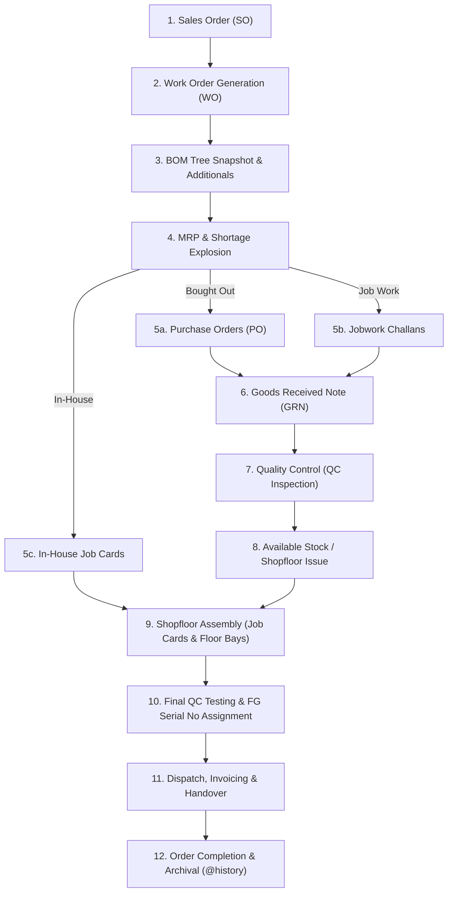

# GEC ERP - Complete Workflow, Business Cycle & Feature Reference Manual

---

## 1. Executive Summary & Architecture Overview

**GEC ERP** is an enterprise manufacturing execution system designed specifically for plastic injection moulding machine manufacturing. The system manages the complete product lifecycle from **Sales Order booking** through **Multi-Level BOM Explosion**, **Procurement / Jobwork Shortage Routing**, **GRN / QC Inspections**, **Shopfloor Assembly Progression**, **Serial Number Tracking**, and **Dispatch / Order Completion**.

---

## 2. Complete End-to-End Lifecycle (SO till Delivery & History)

### Step 1: Sales Order (SO) Booking
- **Module**: `SalesOrderModule`
- **Trigger**: Customer Purchase Order received.
- **Workflow**:
  1. User selects customer from Master or enters new customer details.
  2. Selects ordered machine item (from full Item Master or registered Finished Goods BOMs).
  3. Specifies quantity, agreed delivery deadline, and custom commercial notes.
  4. System generates `SO-GEC-XXX` in **`CONFIRMED`** status.

---

### Step 2: Work Order (WO) Generation & BOM Customization
- **Module**: `WorkOrderModule`
- **Trigger**: User clicks **"Generate Work Order"** on the confirmed Sales Order.
- **Workflow**:
  1. System creates linked `WO-GEC-XXX` in **`PLANNED`** stage and **`IN_PROGRESS`** status.
  2. The registered Master BOM is copied into an **isolated snapshot** for this Work Order.
  3. **Direct Components View**: Users can view the BOM table, edit quantities inline, delete parts, or click any sub-assembly with `BOM ➔` to drill down into nested sub-BOM levels.
  4. **⚡ Exploded BOM View**: Users can toggle to view the flattened raw material requirements across all sub-levels.
  5. **Additional Products**: Users can attach non-BOM auxiliary tooling, extra attachments, and client customization products.
  6. The Sales Order status updates to **`WO_GENERATED`**. The SO table displays the clickable WO badge.

---

### Step 3: Material Routing & Shortage Explosion (MRP)
- **Module**: `ShortageModule` / `MRPPlanningModule`
- **Trigger**: Work Order components are analyzed against live inventory stock.
- **Workflow**:
  - The system routes each component based on its **Material Process Source**:
    1. **Bought Out**: Routed exclusively to **Purchase Order Shortage**.
    2. **In-House**: Routed exclusively to **In-House Job Card Shortage**.
    3. **Job Work**: Routed exclusively to **External Jobwork Challan Shortage**.
    4. **Job Work + Brought Out**: System displays a decision modal allowing the user to route to PO, Jobwork, or split between both (provided both quantities satisfy MOQ).

---

### Step 4: Procurement & Inward Processing
- **Modules**: `PurchaseOrderModule`, `ExternalInventoryModule`, `GRNModule`
- **Workflow**:
  1. **PO Issuance**: Auto-generated or manual POs issued to approved vendors with delivery dates.
  2. **Jobwork Issuance**: Raw materials issued to jobwork vendors via Delivery Challan.
  3. **Material Inward**: When material arrives at the factory gate, a Goods Received Note (`GRN-YYYY-XXX`) is registered against the PO or Jobwork Challan.
  4. Initial status: **`PENDING_INSPECTION`**.

---

### Step 5: Quality Inspection & Stock Allocation
- **Module**: `QualityControlModule`
- **Trigger**: GRN inward or completed assembly stage.
- **Workflow**:
  1. QC inspector tests dimensions, hardness, electrical parameters, or metallurgical test reports.
  2. **Approved Quantity**: Automatically moves into available In-House Inventory.
  3. **Rejected Quantity**: Flagged for vendor debit note, return, or rework.

---

### Step 6: Shopfloor Execution & Floor Bay Progression
- **Modules**: `JobCardModule`, `FloorPlanningModule`
- **Workflow**:
  1. Production Supervisor issues Job Cards for specific sub-assembly stages:
     - Stage 1: Base Fabrication & Machining
     - Stage 2: Clamping Unit & Platen Fitment
     - Stage 3: Injection Unit & Screw Assembly
     - Stage 4: Hydraulic Manifold & Valve Piping
     - Stage 5: Electrical PLC & Wiring Harness
     - Stage 6: Dry Run & Pressure Calibration
     - Stage 7: Final Quality Inspection Passed
  2. As operators mark Job Card progress, the linked Work Order and Shopfloor Bay progress bars update dynamically.

---

### Step 7: Final QC & Finished Goods Registration
- **Modules**: `QualityControlModule`, `DispatchModule`
- **Trigger**: All assembly stages reach 100% and pass final dry run pressure calibration.
- **Workflow**:
  1. Work Order stage advances to **`QUALITY_PASSED`**.
  2. System registers a **Finished Good Unit** with a unique machine serial number (e.g. `GEC-MCH-SN-2026-001`) carrying the linked `woId` and `soId`.

---

### Step 8: Dispatch, Invoicing & Completion
- **Module**: `DispatchModule`
- **Trigger**: Logistics dispatch against customer Sales Order.
- **Workflow**:
  1. Customer machine unit is selected for dispatch.
  2. Tax Invoice number, Delivery Challan, Transporter name, and Vehicle number are recorded.
  3. **Work Order**: Stage set to **`DISPATCHED`**, Status set to **`COMPLETED` / `CLOSED`**.
  4. **Sales Order**: Status set to **`COMPLETED`**.
  5. **Finished Good Unit**: Status set to **`DISPATCHED`**.

---

## 3. How a Work Order (WO) is Closed or Completed

| Closure Phase | Triggering Action | System Effect |
| :--- | :--- | :--- |
| **Production Completion** | All Job Cards completed + Final QC Passed (`QUALITY_PASSED`) | Work Order stage becomes `QUALITY_PASSED`; Finished Good serial number assigned. |
| **Commercial Completion** | Dispatch recorded with Invoice & E-Way Bill in Dispatch Module | Work Order status becomes `COMPLETED` / `CLOSED`. Sales Order status becomes `COMPLETED`. |
| **Manual Supervisor Closure** | Stage Update modal in Work Order Module set to `QUALITY_PASSED` / `COMPLETED` | Work Order moves from active pipeline to completed state. |

---

## 4. Architecture of the `@history` Feature

### Current Implementation Status:
- **Status**: Currently pending implementation.
- **Current Behavior**: Completed records remain in active tables and are filtered via status dropdowns (`Stage: ALL` vs `Stage: QUALITY_PASSED`, `Status: COMPLETED`).

### Proposed `@history` Implementation:
1. **Clean Default Views**:
   - By default, all table views across all modules will show only **Active / Open records** (e.g. active WOs in production, pending SOs, open POs, pending GRNs).
2. **Explicit Search Command (`@history`)**:
   - Typing `@history` into the search bar switches the view to display **Closed / Completed / Dispatched records**.
   - Typing `@history <keyword>` (e.g. `@history Reliance` or `@history WO-001`) searches exclusively within archived and completed records.

---

## 5. Complete Filter & Sorting Catalog Across All Modules

| # | Module Name | Live Search Fields | Dropdown & Toggle Filters | Column Sorting Controls |
| :-: | :--- | :--- | :--- | :--- |
| **1** | **Sales Orders** | SO No, Customer Name, Machine Model/Item | — | SO Number, Customer Name, Machine Model, Quantity, Order Date |
| **2** | **Work Orders** | WO No, Machine Model, Lead Operator, Component Name (in BOM Editor) | • Stage Filter (`ALL`, `PLANNED`, `BASE_FABRICATION`, `CLAMPING_ASSEMBLY`, `INJECTION_UNIT_BUILD`, `HYDRAULIC_POWERPACK`, `ELECTRICAL_CABINET`, `FINAL_TESTING`, `QUALITY_PASSED`) • Date Range (Start Date, Target Date) • Category Filter (in BOM Editor) • View Mode: Direct vs Exploded BOM | WO Number, Machine Model, Build Qty, Stage, Target Completion Date |
| **3** | **BOM Master** | BOM Code, Machine Model, Component Code/Name | • Item Category (`ALL`, `MC`, `EL`, `HY`, `PN`, `MS`) • View Mode Toggle: Direct vs ⚡ Exploded BOM | BOM Code, Machine Model, Version |
| **4** | **Item Master** | Item Code, Part Code, Old Code, Description | • Class / Category (`ALL`, `AS`, `FAS`, `LC`, `MF`, `RM`, `BO`, `CON`) • Process Source (`ALL`, `Brought out`, `In-house`, `Job work`, `Job work + Bought out`) • Stock Status (`ALL`, `In Stock`, `Low Stock`, `Out of Stock`) | Item Code, Part Code, Old Code, Description, Category, Process Source, In-House Stock, Unit Price |
| **5** | **Shortage & MRP** | Component Code, Description, Sub-Assembly Tag | • Work Order / Sales Order selector • Process Routing (`Bought Out / PO Shortage`, `In-House Job Card Shortage`, `Job Work Shortage`) | Component Code, Description, Process Source, Shortage Qty |
| **6** | **Purchase Orders** | PO Number, Vendor Name, Item Code | • PO Status (`ALL`, `DRAFT`, `ISSUED`, `PARTIALLY_RECEIVED`, `COMPLETED`, `CANCELLED`) | PO Number, Vendor Name, Order Date, Delivery Date, Total Amount, Status |
| **7** | **Goods Received (GRN)** | GRN Number, PO Reference, Vendor Name, Challan Number | • QC Status (`ALL`, `PENDING_INSPECTION`, `QC_APPROVED`, `QC_REJECTED`) | GRN Number, Inward Date, PO Reference, Vendor Name, Status |
| **8** | **Job Cards** | Job Card No, WO No, Assembly Name, Lead Operator | • Sub-Assembly Stage (`ALL`, `Base Frame`, `Clamping Unit`, `Injection Unit`, `Hydraulics`, `Electrical`) • Status (`ALL`, `PLANNED`, `IN_PROGRESS`, `PAUSED`, `COMPLETED`) | Job Card No, WO No, Sub-Assembly, Assigned Lead, Target Date, Status |
| **9** | **External Jobwork** | Challan No, Vendor Name, Process, Item Description | • Status (`ALL`, `ISSUED`, `IN_TRANSIT`, `PARTIALLY_RETURNED`, `COMPLETED`) | Challan No, Date, Vendor Name, Process, Status |
| **10** | **Quality Control (QC)** | Inspection No, Reference Doc (GRN/JC), Item Code, Inspector | • Reference Type (`ALL`, `GRN`, `ASSEMBLY`, `IN_HOUSE_PROCESS`) • QC Disposition (`ALL`, `PENDING`, `APPROVED`, `REJECTED`, `CONDITIONAL_APPROVAL`) | Inspection No, Date, Reference Type, Item Description, Status |
| **11** | **Shopfloor Bay Planning** | — | • Floor Bay Selector (`ALL`, Bay-1, Bay-2, Bay-3, etc.) • Bay Status (`ALL`, `Active`, `Blocked`, `Completed`) | Bay Name, Active WO, Progress % |
| **12** | **Finished Goods & Dispatch** | Serial No, Machine Model, SO Ref, Customer Name, Invoice No | • Inventory Status (`ALL`, `AVAILABLE_FOR_DISPATCH`, `DISPATCHED`) | Serial No, Machine Model, SO Reference, Customer, Dispatch Date |
| **13** | **Security Audit Logs** | Detail text, Item codes, Document numbers, IP addresses | • User Filter (`ALL` or specific user drilldown) • Action Type (`ALL`, `CREATE`, `UPDATE`, `DELETE`, `APPROVE/QC`, `DISPATCH`, `BACKUP/RESTORE`, `SYSTEM`) • Module Filter (Item Master, BOM Master, Sales Orders, Work Orders, Job Cards, PO, GRN, Jobwork, Floor Planning, Customers, Vendors, QC, User Mgmt, Backup) • Time Range (`ALL_TIME`, `TODAY`, `PAST_24_HOURS`, `PAST_7_DAYS`, `PAST_30_DAYS`) | Timestamp, User Name, Action Type, Module |
| **14** | **Customer Master** | Customer Code, Name, City, GSTIN, Contact Person | — | Customer Code, Name, City, GSTIN, Phone |
| **15** | **Vendor Master** | Vendor Code, Name, Category, City, GSTIN | • Vendor Category (`ALL`, Raw Material, Fasteners, Hydraulic Components, Electrical/Electronics, Machining/Jobwork) | Vendor Code, Name, Category, City, Rating |
